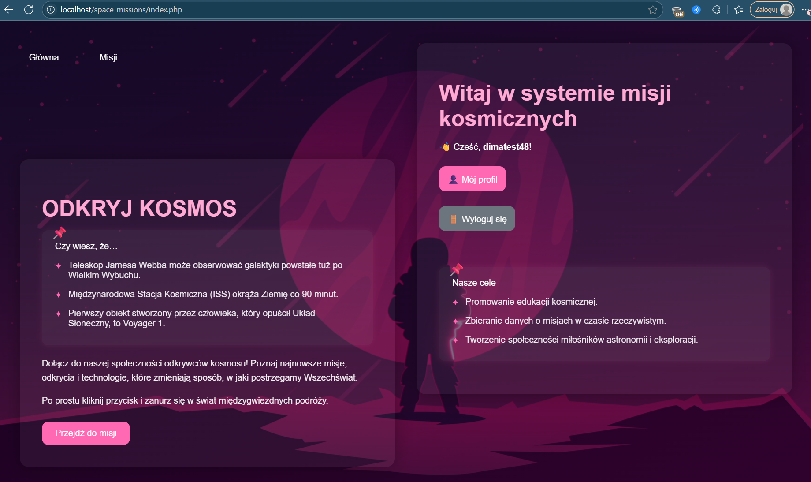
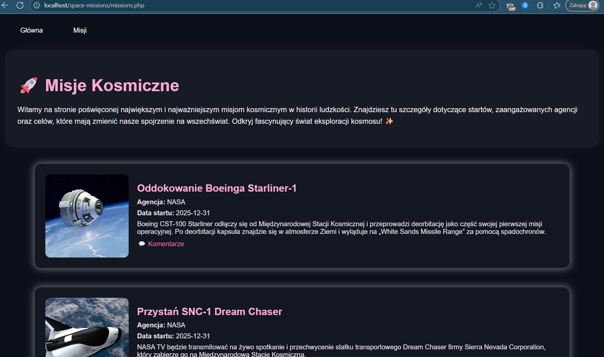
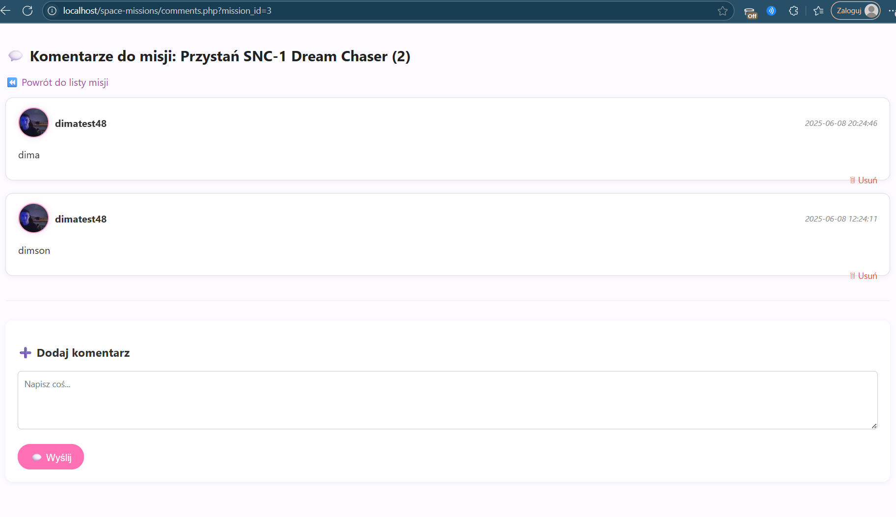

# 🚀 Misje Kosmiczne

System webowy stworzony w celu zarządzania i komentowania historycznych misji kosmicznych. Projekt wykonany w ramach przedmiotu **Projektowanie serwisów internetowych**.

---

## 🧪 Technologie

- PHP 8.x (bez frameworków)
- MySQL
- HTML5 + CSS3
- JavaScript
- XAMPP (lokalne uruchamianie)

---

## 📁 Struktura projektu

- `index.php` – strona główna z ekranem powitalnym
- `missions.php` – lista misji z agencjami i datami
- `comments.php` – system komentarzy do każdej misji
- `profile.php` – panel użytkownika (z awatarem)
- `register.php` / `login.php` – rejestracja i logowanie
- `assets/` – style CSS, wideo tła
- `avatars/` – zapisane zdjęcia profilowe użytkowników
- `images/` – grafiki misji
- `sql/init.sql` – baza danych projektu
- `space_db.sql` – eksportowana baza danych z PhpMyAdmin

---

## 🔐 Funkcje użytkownika

- Rejestracja i logowanie
- Możliwość komentowania misji
- Wyświetlanie avatarów i profilu
- Obsługa sesji użytkownika

## 🛠️ Funkcje administratora

- Usuwanie komentarzy
- Podgląd użytkowników

---

## 💽 Baza danych

Zawarta w pliku `space_db.sql`.  
Zawiera tabele:
- `users`
- `missions`
- `agencies`
- `comments`

---

## 📸 Zrzuty ekranu

📷 

## 🔧 Uruchamianie projektu

1. Zainstaluj [XAMPP](https://www.apachefriends.org/pl/index.html)
2. Skopiuj folder `space-missions` do `htdocs`
3. Uruchom Apache + MySQL
4. Wgraj `space_db.sql` do phpMyAdmin
5. Otwórz `http://localhost/space-missions/`

---

## ✍️ Autor

Projekt wykonany przez **Dmytro Spilniuk**   
Uniwersytet: **Jana Dułgosza w Częstochowie**
